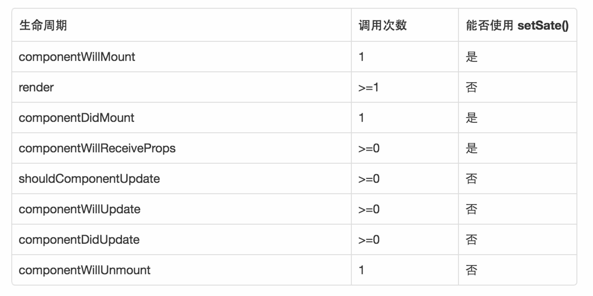

# Path

## Base
### LifeCycle
* `componentWillMount`         准备加载组件
* `componentDidMount`          在组件第一次绘制之后
* `componentDidMount`          在组件第一次绘制之后
* `componentWillReceiveProps`  如果组件收到新的属性（props）
* `shouldComponentUpdate`      当组件接收到新的属性和状态改变的话，都会触发调用
* `componentWillUpdate`        如果组件状态或者属性改变，并且上面的 shouldComponentUpdate(...) 返回为 true ，就会开始准更新组件
* `componentDidUpdate`         调用了 render() 更新完成界面之后
* `componentWillUnmount`       当组件要被从界面上移除的时候

## Component
### Done
* `TabBar`
* `NavBar`
* `Nav`
* `Btn`
* `If`

### Todo
* `Form` 参考`tcomb`, `tcomb-validation`, `tcomb-form-native`

## Problem
***
* 如何循环多个子节点`<TabBarIOS> <TabBarIOS.Item /> <TabBarIOS.Item /> ... </TabBarIOS>`
  * Answer:
    * JSX中会处理数组对象，将数组元素作为循环的子节点

***
* Navigator切换的时候内容的变化时出现卡顿(包括LeftButton, RightButton, Title等) `titleDelayRefreshPro`
  * Answer:
    * Navigator的切换会触发renderScene以及NavigationBar中的LeftButton,RightButton,Title函数，使用回调中的route就可以解决内容卡顿的问题

***
* Navigator与TabBar的配合使用 `navTabCombinePro` [这是一个值得思考的问题]
  * Answer:
    * 以Navigator作为master，tab的点击触发Navigator的resetTo方法，resetTo所干的事情就是返回一个新的tab(这个tab就是下次要展示的tab标签的tab)

***
* 如何动态控制Navigator的显示与隐藏(见证数据的流动) [这是一个思考了很久的问题]
  * Answer:
    * 通过动态控制Navigator的navigationBar属性就可动态控制Navigator的显示与隐藏(通过props属性动态控制)
    * `props`的值必定要与`state`绑定   `<Nav dataSource={NavDataSource} showNav={this.state.showNav}/>`
    * 跨组件的数据流动 `<PathTabBar navigators={navigators} initialTab='我' nav={me}/>`
    * 跨组件的`setState` `me.props.nav.setState({showNav: false})`

***
